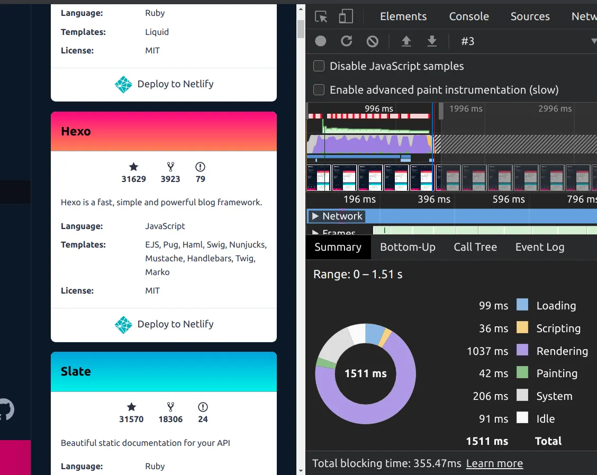
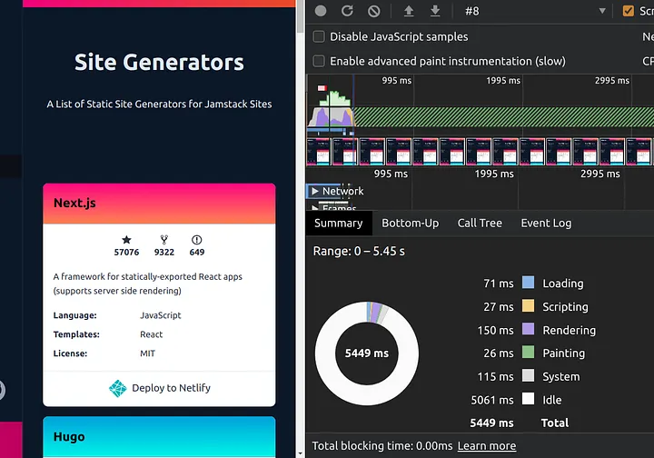
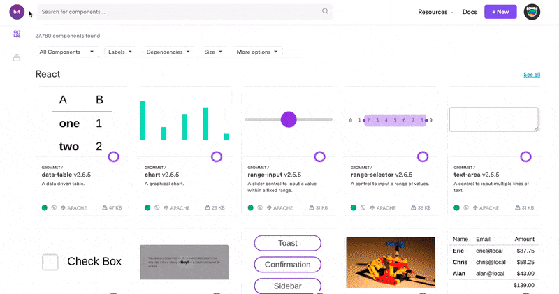
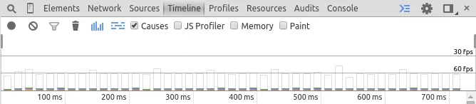
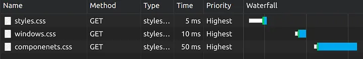
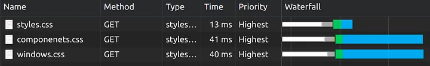

<!-- Progressive-Rendering.md -->
<h2>Progressive Rendering Techniques</h2>
To enhance user experience and web performance, progressive rendering employs several techniques:

| Technique | Description | Use Case |
|------------|------------|-----------|
| Lazy Loading | Content (images, scripts, etc.) is only loaded as needed, typically when it enters the viewport or is about to become visible.	| Used for images, videos, or other media-rich content to reduce initial load time. |
| Skeleton Screens | Placeholder layouts (skeletons) are shown until the content is fully loaded, giving users a sense of what's loading and making the wait feel shorter. | Useful for content-heavy applications like social media, news sites, or e-commerce platforms. |
| Progressive Image Loading | Low-quality image placeholders are loaded first, and gradually replaced by higher-quality versions as they load. | Ideal for improving the perceived performance of image-heavy websites. |
| Incremental Rendering	| Breaking down the UI into smaller chunks that are processed and delivered piecemeal, so the user can start interacting with parts of the page as they become available.	| Used in web applications with complex interfaces to quickly provide interactive elements to the user.
| Streamed Content Loading | Content is loaded and displayed in chunks as it arrives from the server, rather than waiting for the entire payload. | Effective for loading large datasets or files, such as logs, large articles, or streaming media.
| Async Components | Components are loaded asynchronously, allowing the rest of the page to be interactive while waiting for heavier components to load. | Useful for applications with modular designs, where certain sections or features are not immediately critical.
| Prioritized Loading | Resources are loaded based on their priority, with critical assets loaded first and less important ones later. | Ideal for optimizing critical rendering paths, especially on content-rich or highly interactive sites.
| Responsive Images | Different image sizes are loaded based on the screen size and resolution, ensuring fast loading without sacrificing quality. | Best for responsive web designs where image quality and load times need to balance across devices. |

<h2>Conclusion</h2>
In essence, Progressive rendering transforms the web browsing experience by prioritizing 
quick and incremental content delivery, ensuring users can engage with content faster 
than ever before. Through innovative techniques and strategic implementation, progressive 
rendering is setting new standards for web development, paving the way for a future where 
slow-loading pages are a relic of the past.

<h2>Techniques with Examples</h2>

<a href="https://en.wikipedia.org/wiki/Lazy_loading">Lazy loading</a> of images where 
(typically) some javascript will load an image when it comes into the browsers viewport 
instead of loading all images at page load.
<a href="https://developers.google.com/speed/docs/insights/PrioritizeVisibleContent">
Prioritizing visible content</a> (or above the fold rendering) where you include only 
the minimum css/content/scripts necessary for the amount of page that would be rendered 
in the users browser first to display as quickly as possible, you can then use deferred 
javascript (domready/load) to load in other resources and content.

<!--~~~~~~~~~~~~~~~~~~~~~~~~~~~~~~~~~~~~~~~~~~~~~~~~~~~~~~~~~~~~~~~~~~~~~~~~~~~~~~~~~~~~~~~~~~~~-->
<h1>Improve Page Rendering Speed Using Only CSS</h1>
<!--~~~~~~~~~~~~~~~~~~~~~~~~~~~~~~~~~~~~~~~~~~~~~~~~~~~~~~~~~~~~~~~~~~~~~~~~~~~~~~~~~~~~~~~~~~~~-->

Users love fast web apps. They expect the page to load fast and to function smoothly. If 
there are breaking animations or lags when scrolling, there is a high chance of users 
leaving your website. As a developer, you could do many things to improve the user 
experience. This article will focus on 4 CSS tips you can use to improve the page 
rendering speed.

<!--~~~~~~~~~~~~~~~~~~~~~~~~~~~~~~~~~~~~~~~~~~~~~~~~~~~~~~~~~~~~~~~~~~~~~~~~~~~~~~~~~~~~~~~~~~~~-->
<h2>1. Content-visibility</h2>
<!--~~~~~~~~~~~~~~~~~~~~~~~~~~~~~~~~~~~~~~~~~~~~~~~~~~~~~~~~~~~~~~~~~~~~~~~~~~~~~~~~~~~~~~~~~~~~-->
In general, most web apps have complex UI elements, and it expands beyond what the user 
sees in the browser view. On such occasions, we can use content-visibility to skip the 
rendering of the off-screen content. This will decrease the page rendering time 
drastically if you have a large amount of content off-screen.

This feature is one of the latest additions, and it is one of the most impactful features 
to improve rendering performance. While content-visibility accepts several values, we can 
use content-visibility: auto; on an element to obtain immediate performance gains.

Let's consider the following page that contains many cards with different info. While 
about 12 cards fit the screen, there are approximately 375 cards in the list. As you 
can see, the browser has taken 1037ms to render this page.

<!--~~~~~~~~~~~~~~~~~~~~~~~~~~~~~~~~~~~~~~~~~~~~~~~~~~~~~~~~~~~~~~~~~~~~~~~~~~~~~~~~~~~~~~~~~~~~-->
<!--~~~~~~~~~~~~~~~~~~~~~~~~~~~~~~~~~~~ Page Rendering (xx) ~~~~~~~~~~~~~~~~~~~~~~~~~~~~~~~~~~~~-->

<!-- image: page-rendering.webp -->

As the next step, you can add content-visibility to all cards.

In this example, after adding content-visibility to the page, rendering time dropped to 
150ms. That's more than 6x performance improvement.
<!--~~~~~~~~~~~~~~~~~~~~~~~~~~~~~~~~~~~~~~~~~~~~~~~~~~~~~~~~~~~~~~~~~~~~~~~~~~~~~~~~~~~~~~~~~~~~-->
<!--~~~~~~~~~~~~~~~~~~~~~~~~~~~~~~~~~~~ Page Rendering 2 (xx) ~~~~~~~~~~~~~~~~~~~~~~~~~~~~~~~~~~~~-->

<!-- image: page-rendering-02.webp -->

As you can see, content-visibility is pretty powerful and highly useful to improve the 
page rendering time. According to the things we discussed so far, you must be thinking 
of it as a silver bullet for page rendering.

<h3>Limitations of content-visibility</h3>
However, there are few areas content-visibility falls apart. I want to highlight two 
points for your consideration.

	- This feature is still experimental.
	As of this moment, Firefox (PC and Android versions), Internet Explorer (I don’t think 
	they have plans to add this to IE) and, Safari (Mac and iOS) do not support content-
	visibility.
	- Issues related to scroll-bar behavior.
	Since elements are initially rendered with 0px height, whenever you scroll down, these 
	elements come into the screen. The actual content will be rendered, and the height of 
	the element will be updated accordingly. This will make the scroll bar behave in 
	an unintended manner.
<!--~~~~~~~~~~~~~~~~~~~~~~~~~~~~~~~~~~~~~~~~~~~~~~~~~~~~~~~~~~~~~~~~~~~~~~~~~~~~~~~~~~~~~~~~~~~~-->
<!--~~~~~~~~~~~~~~~~~~~~~~~~~~~~~~~~~~~ Page Rendering.gif (xx) ~~~~~~~~~~~~~~~~~~~~~~~~~~~~~~~~~~~~-->

<!-- image: page-rendering.gif -->

To fix the scroll bar issue, you can use another CSS property called contain-intrinsic-size. 
It specifies the natural size of an element. Therefore the element will be rendered with 
the given height instead of 0px.

```
.element{
    content-visibility: auto;
    contain-intrinsic-size: 200px;
}
```

However, while experimenting, I noticed that even with containt-intrinsic-size, if we 
are having a large number of elements with content-visibility set to auto you will 
still have smaller scroll bar issues.

Therefore, my recommendation is to plan your layout, decompose it into a few sections and 
then use content-visibility on those sections for better scrollbar behavior.

Tip: Share your reusable components between projects using Bit (Github).

Bit makes it simple to share, document, and reuse independent components between 
projects. Use it to maximize code reuse, keep a consistent design, collaborate 
as a team, speed delivery, and build apps that scale.

<a href="https://bit.dev/">Bit</a> supports Node, React Native, React, Vue, Angular, and more.
<!--~~~~~~~~~~~~~~~~~~~~~~~~~~~~~~~~~~~~~~~~~~~~~~~~~~~~~~~~~~~~~~~~~~~~~~~~~~~~~~~~~~~~~~~~~~~~-->
<!--~~~~~~~~~~~~~~~~~~~~~~~~~~~~~~~~~~~ how-to/example bit (xx) ~~~~~~~~~~~~~~~~~~~~~~~~~~~~~~~~~~~~-->

<image: bit.gif>

2. Will-change property
Animations on the browser aren’t a new thing. Usually, these animations are rendered 
regularly with other elements. However, browsers can now use GPU to optimize some of 
these animation operations.

With will-change CSS property, we can indicate that the element will modify specific 
properties and let the browser perform necessary optimizations beforehand.

What happens underneath is that the browser will create a separate layer for the element. 
After that, it delegates the rendering of that element to the GPU along with other 
optimizations. This will result in a smoother animation as GPU acceleration take over 
the rendering of the animation.

Consider the following CSS class:

<!--~~~~~~~~~~~~~~~~~~~~~~~~~~~~~~~~~~~~~~~~~~~~~~~~~~~~~~~~~~~~~~~~~~~~~~~~~~~~~~~~~~~~~~~~~~~~-->
<h2>2. Will-change property</h2>
<!--~~~~~~~~~~~~~~~~~~~~~~~~~~~~~~~~~~~~~~~~~~~~~~~~~~~~~~~~~~~~~~~~~~~~~~~~~~~~~~~~~~~~~~~~~~~~-->
Animations on the browser aren’t a new thing. Usually, these animations are rendered 
regularly with other elements. However, browsers can now use GPU to optimize some of 
these animation operations.
<blockquote>
With will-change CSS property, we can indicate that the element will modify specific 
properties and let the browser perform necessary optimizations beforehand.
</blockquote>
What happens underneath is that the browser will create a separate layer for the element. 
After that, it delegates the rendering of that element to the GPU along with other 
optimizations. This will result in a smoother animation as GPU acceleration take over 
the rendering of the animation.
Consider the following CSS class:

```
// In stylesheet
.animating-element {
  will-change: opacity;
}
// In HTML
<div class="animating-elememt">
  Animating Child elements
</div>
```

When rendering the above snippet in the browser, it will recognize the will-change 
property and optimize future opacity-related changes.

<blockquote>
According to a performance benchmark done by Maximillian Laumeister, you can see that he 
has obtained over 120FPS rendering speed with this one-line change, which initially was 
at roughly 50FPS.
</blockquote>
<!--~~~~~~~~~~~~~~~~~~~~~~~~~~~~~~~~~~~~~~~~~~~~~~~~~~~~~~~~~~~~~~~~~~~~~~~~~~~~~~~~~~~~~~~~~~~~-->
<!--~~~~~~~~~~~~~~~~~~~~~~~~~~~~~~~~~~~ 02 Page Rendering (xx) ~~~~~~~~~~~~~~~~~~~~~~~~~~~~~~~~~~~~-->
<a href="https://www.maxlaumeister.com/articles/css-will-change-property-a-performance-case-study/"
</a>
<!-- 02-page-rendering.webp -->

<! image click goto: https://www.maxlaumeister.com/articles/css-will-change-property-a-performance-case-study/ -->

<h3>When not to use will-change</h3>
While will-change is intended to improve performance, it also can degrade web app performance if you misuse it.

	- Using will-change indicates that the element will change in the future.<br>
	  So if you try to use will-change along with an animation simultaneously, 
	  it will not give you the optimization. Therefore, it is recommended to 
	  use will-change on the parent element and the animation on the child 
	  element.

```
.my-class{
  will-change: opacity;
}
.child-class{
  transition: opacity 1s ease-in-out;
}
```

	- Do not use elements that are not animating.<br>
	  When you use will-change on an element, the browser will try to optimize it by 
	  moving the element into a new layer and handing over the transformation to the 
	  GPU. If you have nothing to transform, it will result in a waste of resources.

One last thing to keep in mind is that it is advisable to remove will-change from an 
element after completing all the animations.

<!--~~~~~~~~~~~~~~~~~~~~~~~~~~~~~~~~~~~~~~~~~~~~~~~~~~~~~~~~~~~~~~~~~~~~~~~~~~~~~~~~~~~~~~~~~~~~-->
<h2>3. Reducing the Render-blocking time</h2>
<!--~~~~~~~~~~~~~~~~~~~~~~~~~~~~~~~~~~~~~~~~~~~~~~~~~~~~~~~~~~~~~~~~~~~~~~~~~~~~~~~~~~~~~~~~~~~~-->
Today, many web apps must cater to many form factors, including PCs, Tablets, & Mobile 
Phones, etc. To accomplish this responsive nature, we must write new styles according to 
the media sizes. When it comes to the page rendering, it cannot start the rendering 
phase until the<br>
CSS Object Model (CSSOM) is ready. Depending on your web application, you may have a 
large stylesheet that caters to all device form factors.

<blockquote>
However, suppose we split it up into multiple stylesheets depending on the form 
factor. In that case, we can let only the main CSS file block the critical path 
and have it downloaded as a high priority and let other stylesheets download in 
a low priority manner.
</blockquote>

```
<link rel="stylesheet" href="styles.css">
```


<!-- single-stylesheet.webp -->

After decomposing it to multiple stylesheets:

```
<!-- style.css contains only the minimal styles needed for the page rendering -->
<link rel="stylesheet" href="styles.css" media="all" />
<!-- Following stylesheets have only the styles necessary for the form factor -->
<link rel="stylesheet" href="sm.css" media="(min-width: 20em)" />
<link rel="stylesheet" href="md.css" media="(min-width: 64em)" />
<link rel="stylesheet" href="lg.css" media="(min-width: 90em)" />
<link rel="stylesheet" href="ex.css" media="(min-width: 120em)" />
<link rel="stylesheet" href="print.css" media="print" />
```


<!-- multiple-stylesheet.webp -->
As you can see, having stylesheets decomposed according to form factors can reduce the 
render-blocking time.
<!--~~~~~~~~~~~~~~~~~~~~~~~~~~~~~~~~~~~~~~~~~~~~~~~~~~~~~~~~~~~~~~~~~~~~~~~~~~~~~~~~~~~~~~~~~~~~-->
<h2>4. Avoiding @import to include multiple stylesheets</h2>
<!--~~~~~~~~~~~~~~~~~~~~~~~~~~~~~~~~~~~~~~~~~~~~~~~~~~~~~~~~~~~~~~~~~~~~~~~~~~~~~~~~~~~~~~~~~~~~-->
With @import, we can include a stylesheet in another stylesheet. When we are working on a 
large project, having @import makes the code cleaner.

<blockquote>
The critical fact about @import is that it is a blocking call as it has to make a 
network request to fetch the file, parse it, and include it in the stylesheet. If 
we have nested @import within stylesheets, it will hinder the rendering performance.
</blockquote>

```
# style.css
@import url("windows.css");

# windows.css
@import url("componenets.css");
```


<!-- waterfall-with-imports.webp -->

Instead of using @import we can achieve the same with much better performance by having 
multiple links as it allows us to load stylesheets in parallel.


<!-- waterfall-with-linking.webp -->
<!--~~~~~~~~~~~~~~~~~~~~~~~~~~~~~~~~~~~~~~~~~~~~~~~~~~~~~~~~~~~~~~~~~~~~~~~~~~~~~~~~~~~~~~~~~~~~-->
<h2>Conclusion</h2>
Apart from the 4 areas we discussed in this article, there are few other ways we can use 
CSS to improve the performance of the web page. One of the recent features of CSS, 
content-visibility, looks so promising in the years to come as it gives a multi-fold 
performance gain with page rendering.

The most important thing is, we gained all the performance without writing a single 
statement of JavaScript.

I am confident that you can incorporate some of the above features and build better-
performing web apps for end-users. I hope the article is useful and if you know any 
CSS tips to improve web app performance, please mention them in the comments below. 
Thanks!

<h2><a href="https://blog.bitsrc.io/4-ways-to-remove-unused-css-647828ca629b">4 ways to remove unused CSS.</a></h2>


